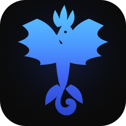

<div align="center">



# FowlPlay

**An AI coding partner for VS Code — collaborative and diff-first like Dino, with a Safe Agentic Workflow harness that makes local models reliable.**

</div>

---

FowlPlay combines two ideas:

1. **The Dino interaction model** — collaborative, synchronous, diff-first coding. Every
   edit the model proposes lands in an in-memory **staging layer** and is shown to you in a
   GitHub-style diff before anything touches disk. You review, comment, revert, and only
   then apply.
2. **The Safe Agentic Workflow (SAW) harness** — a role-gated pipeline (Scout → Stop-the-line
   → Builder → Inspector → Sentry → **you**) with evidence-based gate cards. It exists to
   make **local / self-hosted open-weight models** produce trustworthy output by verifying
   their work *before* it reaches your review.

The thesis: a self-hosted model is good enough for daily IDE work **when a harness checks
its output and a human holds the final gate.** FowlPlay is that harness plus that gate,
wrapped in a fast, minimal, Dino-style UI — in **ultramarine blue**, with a blue phoenix mark.

> This project was built to explore **UC2 (VS Code Coding Assistant)** from the *LLM-in-a-Box*
> initiative: evaluating whether self-hosted models are viable for everyday development.

---

## Highlights

- **Bring your own model, local-first.** Presets for Ollama, LM Studio, llama.cpp, and
  mlx-lm (no API key), plus OpenAI, Anthropic, Google, Mistral, DeepSeek, OpenRouter,
  MiniMax, Z.ai, and Moonshot. Any OpenAI- or Anthropic-compatible endpoint works. Keys live
  in VS Code secret storage and never leave your machine.
- **Staging layer.** The model never writes to disk. Edits accumulate as a cumulative
  changeset you can review at any time.
- **Diff review.** GitHub-style viewer with per-hunk inline comments, selective revert
  (cherry-pick), keyboard navigation, and **Apply to Disk** / **Apply & Commit** (with an
  auto-generated commit message and optional co-author trailer).
- **Browse history.** Every applied changeset is frozen and browsable read-only from its
  commit block in the transcript.
- **Conversation branching.** Edit a past message, rerun, rewind, or fork into a new tab —
  the staging layer travels with the branch so chat and workspace stay consistent.
- **The Coop harness.** Toggle **Solo** (plain Dino-style loop) or **Coop** (the SAW
  pipeline). Coop runs Scout (acceptance criteria) → a stop-the-line gate → Builder →
  an independent Inspector (QA) → Sentry (security), each emitting an evidence gate card,
  before handing the diff to you. Security and QA gates cannot be bypassed.
- **Model-agnostic reliability.** Precise multi-file diff edits with a fuzzy-matching ladder
  so weak/local models edit reliably instead of rewriting whole files. Garbage-collected
  context (not lossy compaction) sustains long sessions.

## Requirements

- VS Code 1.85 or later
- Node.js 18+ (for building from source)
- A model provider — a local server (Ollama, LM Studio, …) or an API key

## Install

**From a packaged build:**

```bash
npm install
npm run package        # produces fowlplay-<version>.vsix
code --install-extension fowlplay-0.1.0.vsix
```

**For development:**

```bash
npm install
npm run build          # bundles the extension + webview into dist/
# then press F5 in VS Code to launch an Extension Development Host
```

## Quick start

1. Open a workspace folder in VS Code.
2. Open FowlPlay: **Ctrl/Cmd+Alt+F**, or the phoenix icon in the activity bar, or
   **Ctrl/Cmd+Shift+P → “FowlPlay: Open Tab”**.
3. On first run, complete onboarding: add a provider (a local one like Ollama is featured
   first) and pick a model.
4. Describe a change in plain language. FowlPlay reads your code, proposes edits, and (in
   Coop mode) runs them through the harness.
5. Click **Review Changes**, inspect the diff, comment or revert per hunk, then **Apply to
   Disk** or **Apply & Commit**.

See the **[User Manual](docs/USER_MANUAL.md)** for a screenshot walkthrough.

## Architecture

```
VS Code Extension Host (Node)  ──postMessage──  Webview UI (Preact)
  src/extension/                                 src/webview/
    commands, tabs, secrets,                       chat, diff viewer,
    git, filesystem, providers                     settings, gate cards

              src/core/  (pure TypeScript, no vscode)
   staging layer · changeset/diff engine · agentic loop ·
   Coop harness state machine · provider adapters · context GC
```

`src/core` has no `vscode` dependency, so it is unit-tested with vitest and driven by a
browser harness for Playwright functional tests. See **[ARCHITECTURE.md](ARCHITECTURE.md)**
and **[SPEC.md](SPEC.md)**.

## Development

| Command | What it does |
|---|---|
| `npm run build` | Bundle extension + webview (esbuild) into `dist/` |
| `npm run watch` | Rebuild on change |
| `npm run typecheck` | `tsc --noEmit` over the whole repo |
| `npm test` | Run the vitest unit suite |
| `npm run e2e` | Drive the real webview in headless Chromium (Playwright) |
| `npm run package` | Produce a `.vsix` |

The core logic (staging, diff, conversation tree, harness, providers) is covered by unit
tests; the webview is verified end-to-end by driving the compiled bundle in a browser with
a scripted host bridge.

## Design principles

Collaboration over automation. Thinking over typing. Review every line. Any model, any
budget. A harness earns trust for local models; the human is always the final gate.

## License

MIT
