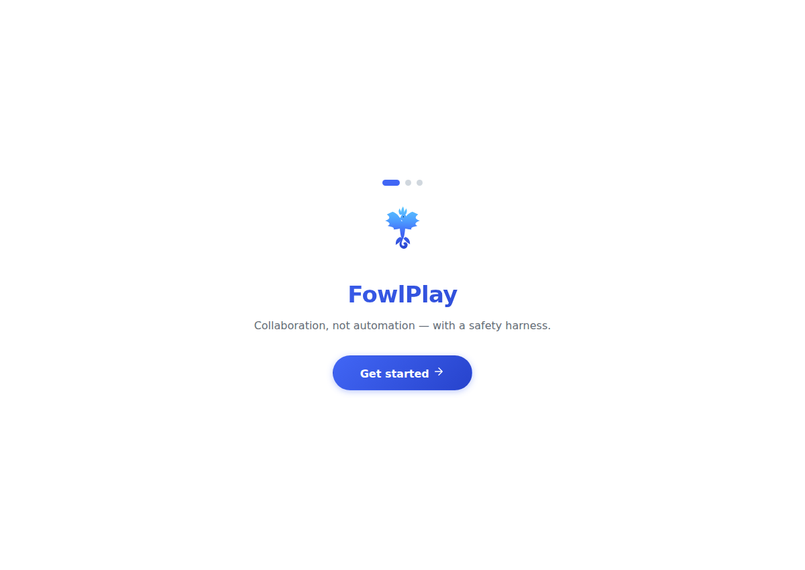
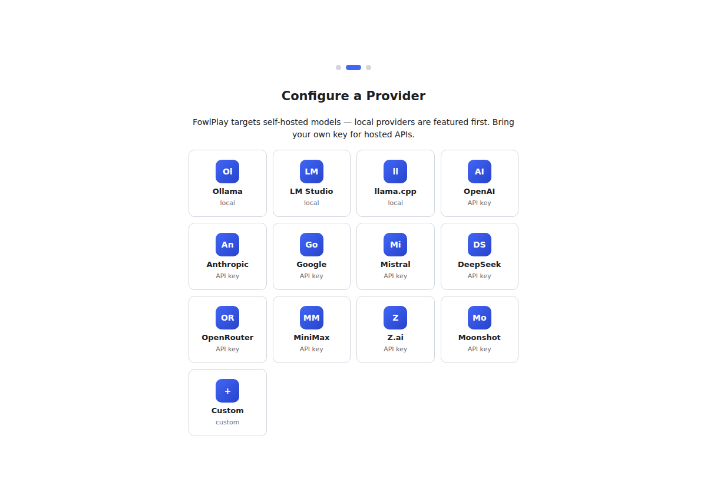
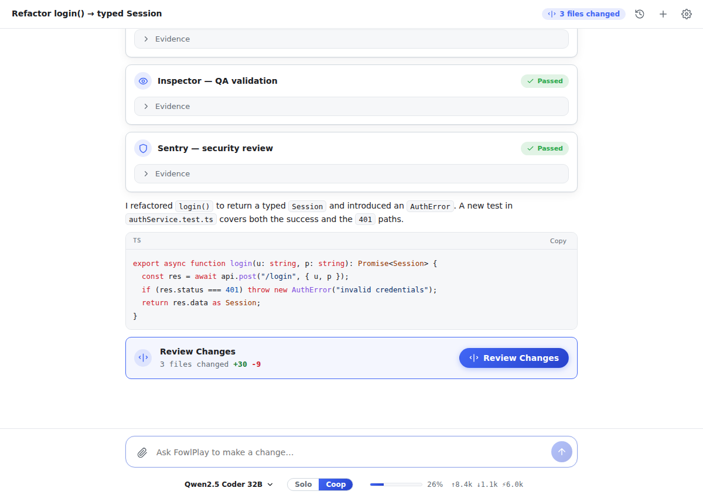
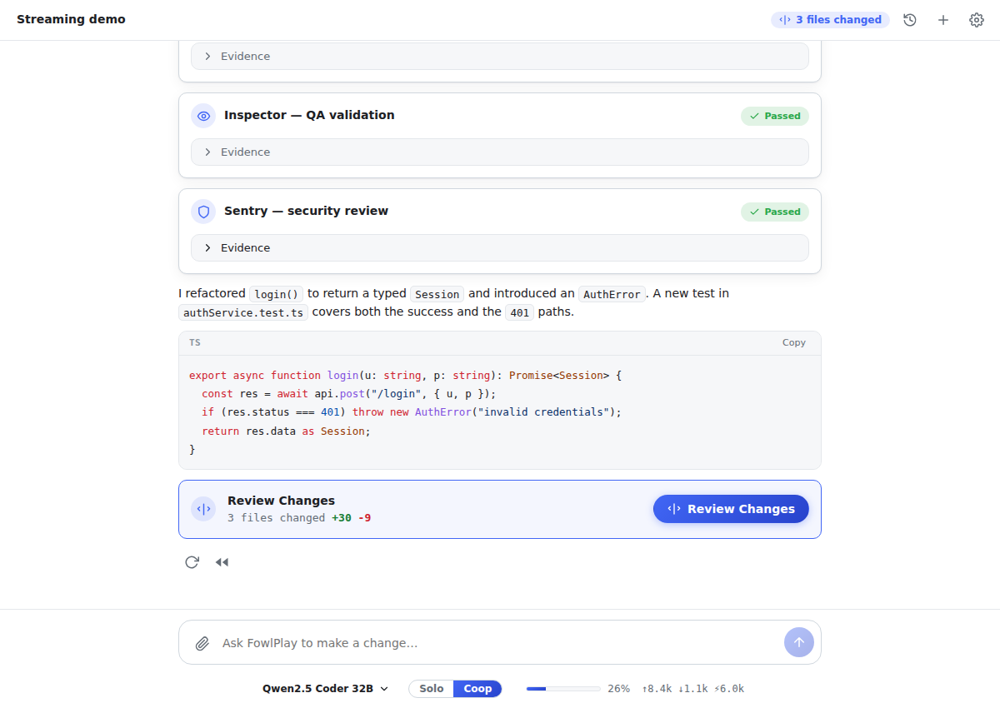
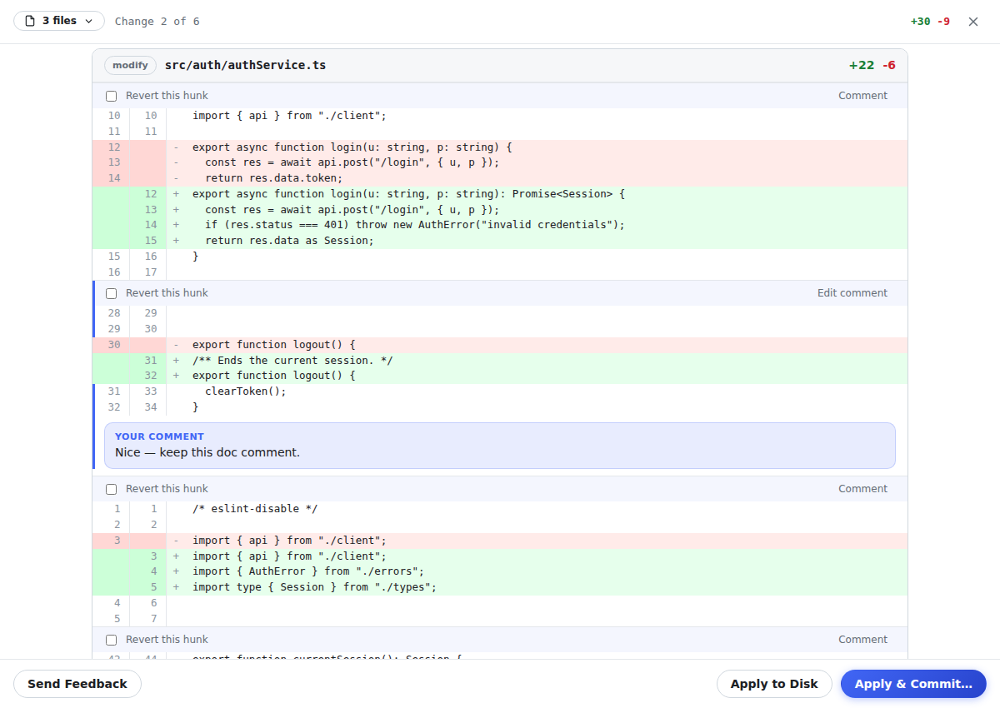
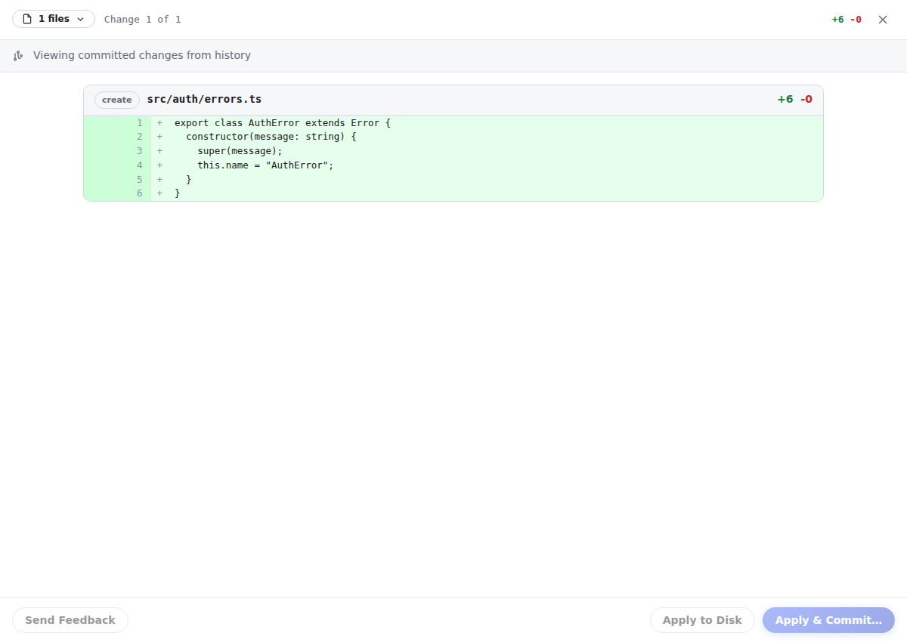
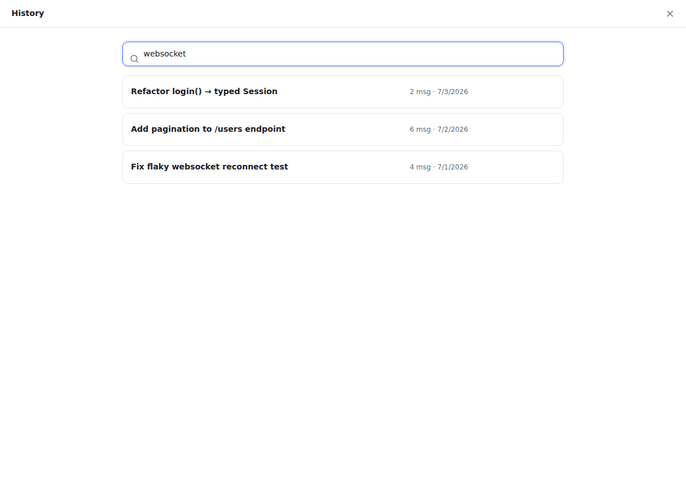
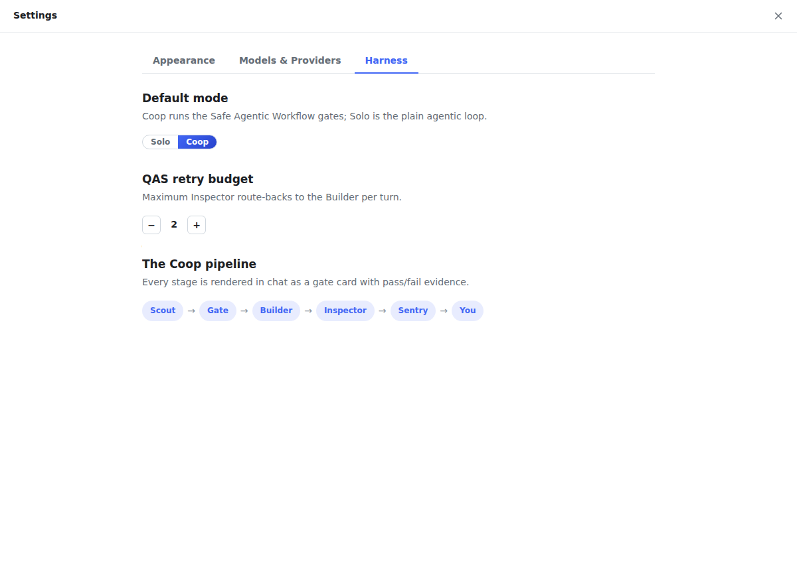

<div align="center">


# FowlPlay — User Manual

*Your AI coding partner for VS Code: collaborative, diff-first, and safe by design.*

</div>

---

## Contents

1. [What FowlPlay is](#1-what-fowlplay-is)
2. [Requirements](#2-requirements)
3. [Booting it up](#3-booting-it-up)
4. [First launch: onboarding](#4-first-launch-onboarding)
5. [The chat interface](#5-the-chat-interface)
6. [Making your first change](#6-making-your-first-change)
7. [Solo vs. Coop mode (the harness)](#7-solo-vs-coop-mode-the-harness)
8. [Reviewing the diff](#8-reviewing-the-diff)
9. [Applying changes](#9-applying-changes)
10. [Browsing history](#10-browsing-history)
11. [Conversation branching](#11-conversation-branching)
12. [Settings](#12-settings)
13. [Keyboard shortcuts](#13-keyboard-shortcuts)
14. [Troubleshooting](#14-troubleshooting)

---

## 1. What FowlPlay is

FowlPlay is a VS Code extension that lets you code *with* an AI model instead of handing
work off to it. You describe a change in plain language; FowlPlay reads your codebase and
proposes edits — but nothing is written to disk until you review a diff and approve it.

Two things make it distinctive:

- **It's model-agnostic and local-first.** Point it at a local server (Ollama, LM Studio,
  llama.cpp, mlx-lm) or any cloud provider. Your keys stay on your machine.
- **It has a safety harness.** In **Coop mode**, the model's work passes through a gated
  pipeline — acceptance criteria, an independent QA reviewer, and a security check — before
  you ever see the diff. This is what makes smaller, self-hosted models trustworthy for
  day-to-day work.

---

## 2. Requirements

| Requirement | Notes |
|---|---|
| VS Code | 1.85 or later |
| OS | macOS, Windows 10/11, or Linux |
| A model | A local server **or** an API key from a provider |
| Node.js 18+ | Only needed to build from source |

---

## 3. Booting it up

You can run FowlPlay three ways.

### A. Install a packaged build (recommended for using it)

```bash
npm install
npm run package                       # → fowlplay-0.1.0.vsix
code --install-extension fowlplay-0.1.0.vsix
```

Then reload VS Code.

### B. Run from source (for development)

```bash
npm install
npm run build                         # bundles into dist/
```

Open the project in VS Code and press **F5**. This launches an **Extension Development
Host** — a second VS Code window with FowlPlay loaded. Open any workspace folder in it to
try the extension.

### C. Watch mode while hacking on FowlPlay

```bash
npm run watch
```

Rebuilds on every change; reload the Extension Development Host to pick up edits.

> **Tip:** FowlPlay operates on a *workspace folder*, not loose files. Open a folder
> (`File → Open Folder…`) so it can read and search your project.

---

## 4. First launch: onboarding

The first time you open FowlPlay it walks you through a short setup.



1. **Welcome** — FowlPlay's philosophy: collaboration, not automation, with a safety harness.


2. **Configure a provider** — local providers are featured first because FowlPlay is built
   for self-hosted models. Pick one:
   - **Ollama** (`http://localhost:11434/v1`) — no API key; just have Ollama running.
   - **LM Studio**, **llama.cpp**, **mlx-lm** — same idea, different default ports.
   - Or a cloud provider (OpenAI, Anthropic, Google, …) — paste your API key.
   - Or **Custom** — any OpenAI- or Anthropic-compatible endpoint.
3. **Select a model** — FowlPlay auto-fetches the provider's model list; choose your default.

Your API keys are stored in VS Code's encrypted secret storage and are only ever sent to
the provider you configured.

---

## 5. The chat interface

Open FowlPlay any time with **Ctrl/Cmd+Alt+F**, the phoenix icon in the activity bar, or
**Ctrl/Cmd+Shift+P → “FowlPlay: Open Tab”**.



- **Title bar** — conversation title (click to rename), history, new chat, settings, and a
  **“N files changed”** pill that opens the diff viewer.
- **Message area** — your prompts and the model's responses. Assistant turns show
  collapsible **thinking blocks**, **tool-call cards** (what files it opened/edited), and —
  in Coop mode — **gate cards**.
- **Composer** — type your request. **Enter** sends, **Shift+Enter** adds a newline,
  **Escape** cancels a response in progress. Use the attachment button to add a file or
  image.
- **Status line** (bottom) — the **model switcher** (click the model name to swap
  provider/model mid-conversation), the **Solo/Coop** toggle, and live token usage.

---

## 6. Making your first change

Describe what you want in plain language — no special syntax, just mention file names if you
like:

> *Refactor the auth service so `login()` returns a typed `Session` and throws `AuthError`
> on bad credentials. Add a test.*

FowlPlay enters an **agentic loop**: it thinks, opens the relevant files, makes edits, and
iterates — all visible live. Because edits go to the staging layer, nothing has touched your
disk yet. When it finishes, a **Review Changes** block appears.

---

## 7. Solo vs. Coop mode (the harness)

Toggle the mode in the status line.

- **Solo** — the plain loop: prompt → edits → review. Fast; best with strong models.
- **Coop** *(default)* — the Safe Agentic Workflow harness runs between your prompt and your
  review:



| Stage | Role | What it does |
|---|---|---|
| **Scout** | BSA | Restates your request as testable acceptance criteria + a plan. Asks a clarifying question instead if the request is ambiguous. |
| **Stop-the-line** | gate | Blocks implementation until acceptance criteria exist. |
| **Builder** | implementer | Writes the staged changeset against the criteria. |
| **Inspector** | QA | Independently checks the diff against each criterion; can route work back to the Builder. |
| **Sentry** | security | Scans the diff for secrets, injection, and unsafe patterns. |
| **You** | HITL | The final gate — the diff review. |

Each stage emits an **evidence gate card** in the chat so you can see what was checked and
why it passed. QA and Security gates can't be bypassed. Coop is what makes local models
reliable: their output is verified before it reaches you.

---

## 8. Reviewing the diff

Click **Review Changes** (or the title-bar pill) to open the GitHub-style diff viewer.



- **Navigate** — the file picker jumps between files; **j/k** or **↓/↑** step through
  individual changes. The footer shows *“Change 3 of 12.”*
- **Comment** — click any hunk to leave inline feedback for the model.
- **Revert** — tick a hunk's checkbox to cherry-pick it out before applying.
- **Send Feedback** — sends your comments and reverts back as a new prompt; the model
  revises the changeset without re-applying what you reverted. Repeat until it's right.

---

## 9. Applying changes

When you're satisfied, choose from the footer:

- **Apply to Disk** — writes the approved changes to your files. No commit — handy for
  running tests first.
- **Apply & Commit…** — writes the changes and creates a git commit. FowlPlay
  auto-generates a commit message (editable) and can add a `Co-authored-by: FowlPlay`
  trailer.

Nothing outside your workspace can ever be written — file paths are confined to the
workspace root.

If the files changed on disk since you staged (e.g. another commit landed), FowlPlay shows a
**rebase banner**; click **Rebase** to merge your staged edits onto the new state.

---

## 10. Browsing history

Every applied changeset is frozen and recorded as a **commit block** in the transcript.



Click **View Changes** on any commit block to reopen that exact diff in **read-only mode**
(a banner marks it as history and the editing controls are disabled). This lets you look
back at precisely what a past change did — even after you've made many more edits since.

---

## 11. Conversation branching

FowlPlay treats each conversation like a git branch.



- **Edit a past message** to branch into a new direction — the original path is preserved.
- **Rerun** a response to get an alternate; **rewind** to an earlier point and continue.
- **Fork** into a new tab — the staging layer travels with the branch, so chat and workspace
  stay consistent.
- The **history panel** (title-bar icon) lets you search, resume, rename, delete, and export
  conversations (Copy as Markdown / JSON).

Each tab is an independent conversation with its own staging layer, so you can work on
several things at once without them colliding.

---

## 12. Settings

Open settings from the gear in the title bar. Three tabs:



- **Appearance** — font (JetBrains Mono by default), font scale, and theme (inherit VS
  Code, or FowlPlay Dark / Light / Midnight — all ultramarine-accented).
- **Models & Providers** — add, edit, or remove providers; manage which models appear in the
  switcher.
- **Harness** — set the default mode (Solo/Coop) and the Inspector's route-back budget, and
  read how the Coop pipeline works.

---

## 13. Keyboard shortcuts

| Action | Shortcut |
|---|---|
| Open FowlPlay tab | `Ctrl/Cmd+Alt+F` |
| Send message | `Enter` |
| New line | `Shift+Enter` |
| Cancel response | `Escape` |
| Next / previous change (diff) | `j` / `k` or `↓` / `↑` |
| Save inline comment | `Enter` |
| Close diff viewer | `Escape` |
| Open command palette actions | `Ctrl/Cmd+Shift+P → “FowlPlay”` |

---

## 14. Troubleshooting

**“No model configured.”** Add a provider and select a model in Settings → Models &
Providers.

**A local model isn't responding.** Make sure the local server is running (e.g.
`ollama serve`) and the base URL/port matches the provider preset.

**Nothing appears on disk after a response.** By design — FowlPlay never writes without
your approval. Open the diff viewer and click **Apply to Disk** or **Apply & Commit**.

**“Files changed on disk since these edits were staged.”** Something modified the files
underneath your staged edits. Click **Rebase** to merge onto the new state.

**Tool calls behave oddly on a weak model.** Try Coop mode (the harness catches incomplete
work), or switch to a stronger model mid-conversation from the status line — your
conversation and staged edits carry over.

---

<div align="center">

*Collaboration over automation. Review every line. The human is the final gate.*

</div>
